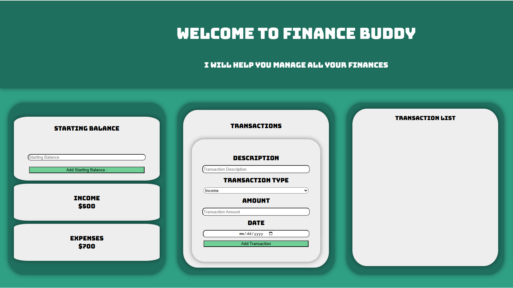
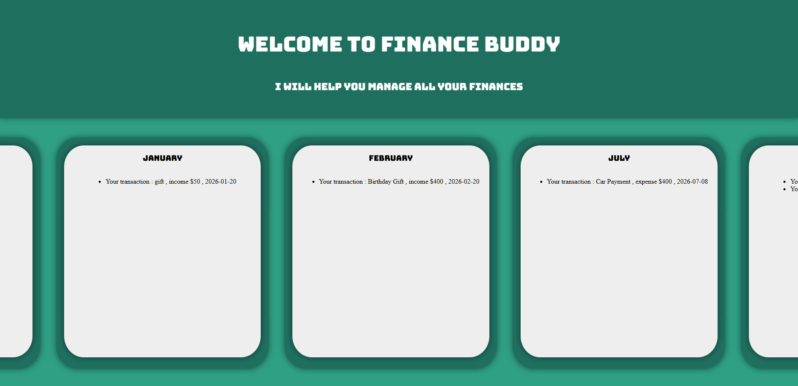
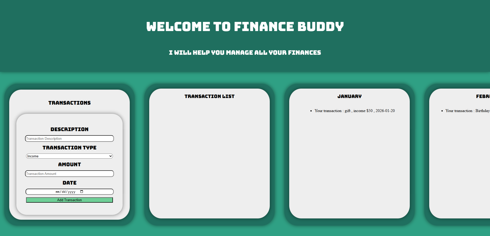

# Finance Buddy

FinanceBuddy is a web-based personal finance tracker that allows users to manage their income and expenses, track transactions by month, and monitor their financial balance.

## 📸Pictures 

## 🚀Features
- Add and categorize transactions (income/expense)
- Automatic grouping of transactions by month
- Real-time calculation of balance, income, and expenses
- Persistent data storage using localStorage
- Responsive UI with horizontal scrolling for monthly views

## 🛠️Tech-Stack
- HTML
- CSS
- JavaScript
- Web Local Storage

## 💡How It Works

Users can set an initial balance and add transactions with a description, type, amount, and date.  
Transactions are automatically grouped by month, and the UI updates dynamically to reflect the current financial state.

## ⚙️How to Run

### Step 1 : Clone the repository
### Step 2 : Open the project folder 
### Step 3 : Launch the app by opening the `index.html` file in a web browser.
### After that the app will load and you can start using it freely .

## 🔮Future Improvements

### Must haves : 
- Add edit and delete functionality for transactions
- Introduce categories (e.g., food, rent, entertainment)
- Add charts for financial insights
### Nice to haves :
- Implement backend support with a database
- Add user authentication

## 👨‍💻 Author

Raul-Valentin Vasile  
[GitHub](https://github.com/raulvasile04)  
[LinkedIn](https://linkedin.com/in/raul-valentin-vasile)
